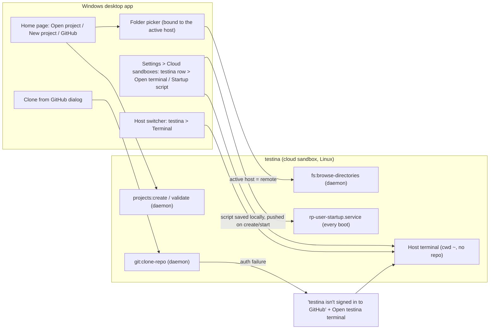

# Design brief: real-user repo flow on remote hosts and cloud sandboxes (2026-10-03, for Red's approval)

Status: **design only, nothing is built.** Building starts only after Red approves. This brief covers the revised done bar (10:40 AM PT) and Red's decisions from 10:56 AM PT.

## Why

On SOBECK, Red's sandbox "testina" broke on the most basic flow.

- Browse in Add Repository and Clone from GitHub opens the **Windows** folder dialog. The project is then created **on the sandbox** using that Windows path. Linux reads `C:\runpane-temp-home\montlakev2` as a relative name, so the result is an empty `git init` at `/home/user/'C:\runpane-temp-home\montlakev2'`, and every pane in it fails.
- This is a stock Pane bug that affects every remote host: `dialog:*` calls run locally, while `projects:*` and `git:clone-repo` run on the active host.
- There is also no terminal on a host until a repo pane exists, so a user can't sign in to GitHub or Codex first.

## Design

Five elements. E1 to E3 are generic remote-host fixes that can go upstream and don't import cloud code. E4 is docs only. E5 is specific to cloud sandboxes.



### E1. Repo actions follow the active host (generic, upstream-able)
- **Buttons:** Open project, New project and GitHub (Clone) on the home page, plus "Add repository" in the sidebar, all act on the **active host**. Each dialog shows a host chip at the top, e.g. `On: testina (cloud sandbox)` or `On: This computer`.
- **Folder picker:**
  - Local host: the native OS dialog, unchanged.
  - Remote host: an in-app folder browser backed by a new daemon-owned channel, `fs:browse-directories {path}`. It returns the subdirectories, a flag for whether each one is a git repo, and the host's home folder. It opens at `~`. It can go up, show hidden folders, and create a new folder (New project and the Clone destination only).
- **Typed paths:** checked **on the active host**.
  - Windows-style paths (a drive letter or backslashes) on a POSIX host are rejected with: "That's a path on this computer; testina is a Linux host. Pick a folder on testina."
  - **Open project** needs an existing git repo there; it never runs `mkdir` or `git init`. **New project** creates the folder.
  - Errors appear in the dialog, not only in the console.
- **Clone destination:** editable, with Browse on the active host. On a remote host it defaults to `~`.

### E2. Host terminal (generic for any remote; cleanly labeled for sandboxes)
- **What it is:** a plain shell on the host with cwd `~`, no repo or pane needed. There is one per host. It persists, so reopening it brings back the same terminal.
- **How it works:** it's backed by a hidden, daemon-owned host session under `~/.pane/sessions/host-terminal`, which reuses the Sessions workspace code. It never shows up as a project.
- **Name:** "Terminal on testina". The tab title is `testina · Terminal` with a host icon (a cloud for a sandbox, a server for a self-hosted host).
- **Where it lives (two entry points, same terminal):**
  1. **Host switcher:** the active remote's row gets a terminal icon button labeled "Open terminal on testina".
  2. **Settings > Cloud sandboxes:** each running row gets **Open terminal** next to Stop. It's hidden while the sandbox is stopped, starting or stopping.
- **Sketch:**
```
┌ Host switcher ───────────────────────────────┐
│ ● testina   cloud sandbox · running   [>_]   │  <- "Open terminal on testina"
│ ○ This computer                              │
│ ─────────────────────────────────────────── │
│ Manage connections…                          │
└──────────────────────────────────────────────┘

Settings › Cloud sandboxes
┌──────────────────────────────────────────────────────────┐
│ testina   Running   rp-pp69t1zz                          │
│ [Open terminal]  [Stop]  [Startup script ▸]  [Remove]     │
│ ⚠ Startup script failed (exit 1) · View log              │  (only when it failed)
└──────────────────────────────────────────────────────────┘

Main area tab:   [☁ testina · Terminal ×]
  user@rp-pp69t1zz:~$ █
```

### E3. Clone sign-in error that leads to the host terminal (generic, upstream-able)
- **When it triggers:** on a remote host, a failed clone is classified from git's message. Examples: HTTPS `could not read Username`, `Authentication failed`, or 403; SSH `Host key verification failed` or `Permission denied (publickey)`.
- **What the dialog shows:** "**testina isn't signed in to GitHub.** Sign in on testina, then try again." It has two buttons:
  - **[Open terminal on testina to sign in]** opens the E2 terminal and types `gh auth login --web --git-protocol https && gh auth setup-git` **without pressing Enter**.
  - **[Try again]** keeps the URL and destination.
- **Local host:** keeps today's messages. The SSH case gets a proper message instead of the raw `Command failed` text.
- **Tested today on a fresh sandbox:**
  - HTTPS fails in under 1 s with "could not read Username… No such device or address". It doesn't hang.
  - SSH fails in about 1 s with "Host key verification failed".
  - montlakev2 is private.

### E3 v2. Sign in to GitHub from Pane (Red, 2026-10-03 12:10 PM PT; REPLACES E3's main path; generic, upstream-able)
**Why:** gh's device flow doesn't start polling until Enter is pressed at "Press Enter to open github.com in your browser…". On a sandbox, that Enter opened Chrome on the SANDBOX's own desktop (with GCM DEPRECATED_ENDPOINT spam), so Red's approval on github.com never completed. Red: "horrible UX". He wants sign-in directly integrated.
- **Main path:** the clone sign-in notice's **"Sign in to GitHub"** action runs gh's device flow FROM PANE, non-interactively, on the ACTIVE host (daemon side):
  1. On the host it runs `BROWSER=false GH_BROWSER=false gh auth login --web --git-protocol https --hostname github.com`, with a newline fed to stdin automatically (or an equivalent that never waits for Enter and never opens a browser on the host).
  2. It parses the one-time code from gh's output and shows it in Pane's UI with a **[Copy]** button, plus an **"Open github.com/login/device"** link that opens on the user's LOCAL computer (shell.openExternal on the desktop, never on the host). The state reads **"Waiting for you to approve on GitHub…"**, with **Cancel**.
  3. When gh finishes, it runs `gh auth setup-git` on the host, then shows **"Signed in to GitHub as <user>"** (from `gh api user` or gh's own line), with **[Try again]** for the clone.
  4. Failures (timeout or expired code, gh missing, non-zero exit) show a clear message plus the terminal fallback.
- **Fallback (stays):** "Open terminal on <host>" with the prefill `BROWSER=false gh auth login --web --git-protocol https && gh auth setup-git` (typed, not submitted), and the hint "Open github.com/login/device on your computer, enter the code, and wait here." BROWSER=false and GH_BROWSER=false are also set in the host terminal's env on cloud sandboxes.
- **Fallback prefill by host OS (E3v2-FB ruling, 12:14 PT):** on Linux/macOS hosts it is the POSIX prefill above. On a **Windows** host it is `$env:BROWSER='false'; gh auth login --web --git-protocol https; if ($?) { gh auth setup-git }` (or an equivalent that never opens a browser). It is chosen by the host's OS and unit-tested per OS.
- **SSH line (E3-O2, approved 11:56):** for SSH clone failures on a remote only: "This is an SSH URL; after signing in, use the HTTPS URL instead."
- **Generic:** works for any remote, on remote/host-repo-actions, with no cloud/ imports.
- **Secrets:** never print or log the token. The device code may be shown in the UI, but never in ledgers, logs or committed screenshots (blurred in evidence).
- **Keyring:** gh stores the token in the system keyring first. If a desktop keyring session on the host could prompt or hang after approval, that must be checked on a real sandbox. The fallback `--insecure-storage` (hosts.yml, 0600, host only) is a security trade-off: ESCALATE it to Red; don't decide it.
- **Done when:** D3 completes the sign-in from Pane's UI with no terminal and no Ctrl-C. The evidence shows the code screen (blurred), then "Signed in as …", then a successful `gh auth status` in the host terminal. No browser process starts on the host. Unit tests cover the code parsing, the states, Cancel, the failures and the local-only link; mutation-checked.

### E4. Codex login (docs only)
- **Today:** the sandbox image has Codex 0.160.0, but it isn't signed in. The identity reset deletes `~/.codex/auth.json` on purpose.
- **This pass:** the user runs `codex login --device-auth` in the E2 terminal. Docs get one line. Claude stays signed in automatically, as today.

### E5. User startup script that runs on every sandbox start (cloud sandboxes only)
- **Configured in:** Settings > Cloud sandboxes > **Startup script**, one script per user that applies to every sandbox. It's a plain editor with a warning: "Don't put secrets here; it's stored unencrypted."
- **Stored at:**
  - Locally: `<pane data dir>/cloud-sandboxes/startup.sh`, next to the saved sandbox records.
  - On the sandbox: pushed to `~/.config/runpane-cloud/startup.sh`, mode 0700, owned by `user`.
- **When it runs:**
  - On every boot of the sandbox, through a systemd system unit `rp-user-startup.service` that runs as `user` (Type=oneshot, After=network-online.target). boat's Start boots from the disk snapshot, so this covers every Start.
  - The desktop also triggers it once after Create and after an edit, through the boat command API.
  - It never blocks the Pane daemon, which starts independently.
- **Updates:** the desktop pushes the current script on Create and on every Start before the health check, so an edit applies at the next start.
- **Time limit:** 10 minutes, then killed.
- **Idempotency:** the user's job, and the docs say so: runs every start, so guard installs with `command -v x || install`. The unit itself is idempotent; it overwrites the status and keeps the last 5 logs.
- **Logs:** `~/.local/state/runpane-cloud/startup.log` (rotated, last 5 runs) and `startup-status.json` with exitCode, startedAt, finishedAt, the script's sha256 and timedOut.
- **Failure surfacing:**
  - After Create or Start, the desktop reads the status file. On a non-zero exit or a timeout, the sandbox row shows "⚠ Startup script failed (exit N) · View log". View log shows the last 200 lines.
  - The sandbox stays usable.
  - Create's progress shows "Running your startup script…" while it runs.
- **Red's Doppler install is just his script content,** not product code. For example: `command -v doppler >/dev/null || curl -Ls --tlsv1.2 --proto "=https" https://cli.doppler.com/install.sh | sudo sh`. He then runs `doppler login` himself in the terminal.

### What exists today (answer to Red's question 4)
- **Image:** boat's stock image. The app sends only size, `ttlSeconds:null` and `noEnv:true`, with no custom image, golden or fork. A fresh sandbox checked today has Ubuntu 24.04 with Claude Code 2.1.288, Codex 0.160.0, gh 2.97, git 2.43 and node 24, preinstalled by boat. Doppler is not there.
- **Setup on Create** (`rp-bootstrap.sh`, run over the boat command API): identity reset, Tailscale install and join, firewall, Claude token, Claude prompts, Pane .deb install with linger, pairing, Serve, and the Claude model.
- **What runs on every start:**
  - Our boot units: tailscale-state restore, serve restore, firewall, the Pane daemon user service.
  - `rp-firstboot-identity`, on the first boot only.
  - On Start, the desktop also re-syncs the Claude model, and repairs the tailnet node if the daemon doesn't answer.
  - **Nothing user-defined runs today.**

## Done-when = Red's 6 bar items, driven through the real Windows UI on SOBECK

The test kit is a Playwright attach to the PaneCloudSandbox Electron window. It clicks the same controls a user would, takes a screenshot at every step and records video of the whole run. Checks inside the sandbox are read-only. Uses 2 test-wallet starts (Create, then one Stop/Start).

| # | Bar item | Done-when step (UI) | Evidence |
|---|---|---|---|
| D0 | (setup) | Settings > Cloud sandboxes > Startup script: paste a test script that writes a marker line and the date. Add cloud sandbox "e2e-<date>". | screenshots of the progress and "Running your startup script…" |
| D1 | 5 + E2 | Host switcher > [>_] Open terminal on e2e. `whoami; hostname; pwd` shows `user`, `rp-…`, `/home/user`. | screenshot of the terminal tab and its title |
| D2 | 5, 3 | (E3v2-FA ruling, 12:14 PT) After D3's in-app sign-in: `gh auth status` in the host terminal shows logged in. Then **Red** completes `codex login --device-auth` in the host terminal (device code; the kit pauses for him), and `codex login status` shows logged in. | screenshots with no tokens or codes visible |
| D3 | 2 + E3 v2 | *Negative check, before D2 on a second clone attempt:* GitHub > Clone montlakev2 shows "isn't signed in to GitHub". **E3 v2:** "Sign in to GitHub" shows the device code (Copy, plus "Open github.com/login/device" opening locally) and "Waiting for you to approve on GitHub…"; Red approves on github.com; Pane shows "Signed in to GitHub as <user>" with NO terminal and NO Ctrl-C; Try again clones. No browser process on the sandbox. The terminal fallback (prefilled, not submitted) is also shown. | screenshots (code blurred) + `gh auth status` in the host terminal |
| D4 | 1, 2 + E1 | Home > GitHub: URL `https://github.com/jamari-morrison/montlakev2`, Browse shows the **sandbox's** folders (`/home/user`), destination `~`, Clone. Repo opens. Also: Open project with a typed Windows path is rejected, and Open project via the remote picker on an existing sandbox repo works. | screenshots of the remote picker, the host chip and the project |
| D5 | 3 | New pane in montlakev2. Terminal panel: `pwd; git rev-parse --show-toplevel; git branch --show-current; git worktree list` shows the pane's worktree on the sandbox. | screenshot |
| D6 | 3 | Claude Code panel: ask it to print `pwd` and the branch, which must match D5. Codex panel: the same. | screenshots of both transcripts |
| D7 | 4 + E5 | Host terminal: `cat ~/.local/state/runpane-cloud/startup-status.json` shows exit 0 and the marker. Stop, then Start from the UI; the marker shows a second run. A failing script variant (`exit 1`, set through the UI) shows the ⚠ row chip and View log. | screenshots |
| D8 | 6 | In the pane, Claude edits a file, commits, pushes branch `e2e/<date>` and runs `gh pr create --draft` on **jamari-morrison/montlakev2**. The draft PR URL is shown and opened. | screenshot of the transcript and the PR page |
| D9 | cleanup | The orchestrator removes the sandbox through the UI (Remove), and its tailnet device is gone. The draft PR stays open for Red to close. | screenshot |

Regression checks: the local host is unchanged (the Browse dialog is native), Red's main Pane is untouched, and his testina sandbox is untouched.

## Audit plan (cs-auditor, item by item)
1. **E1 to E5 design vs code:** each requirement above maps to a commit plus a unit test. Tests: browse-directories (home-rooted, errors), Windows-path rejection, Open vs New semantics, clone error classification table, terminal prefill without Enter, startup unit and status parsing, and failure-chip logic.
2. **Upstream-ability:** E1 to E3 files import nothing from `cloud/` and work for a self-hosted remote. The auditor confirms this with a self-hosted agentbox remote check on Linux: remote picker, host terminal and clone error.
3. **Bar items 1 to 6:** for each D-step, the screenshot or video timestamp exists, is from the real Windows UI (not API calls), and shows the stated result. A step without UI evidence fails.
4. **Negative and UX paths:** unauthenticated clone message, typed Windows path, a stopped sandbox hides Open terminal, and a failing startup script surfaces in the row.
5. **Secrets:** no tokens in screenshots, video, Playwright traces, logs or the startup log. A grep of artifacts for token patterns comes back clean.
6. **Docs:** the cloud sandbox doc has the Codex login line, the startup script page (where it's stored, every-start semantics, idempotency, logs) and the known limits. The PR body is updated.
7. **Verdict:** pass or fail per element E1 to E5 and per bar item 1 to 6, with evidence paths.

## Wave plan (after Red approves)
The orchestrator runs 8 full Pane Opus 5.5 agents on the Agent Farm raw profile, with no subagents. E1 to E3 are built on a branch shaped for upstream, `remote/host-repo-actions`, off upstream main, and merged into `cs/integration`.

| Agent | Scope |
|---|---|
| cs-remote-fs | E1 daemon side: `fs:browse-directories`, typed-path validation on the host, Open vs New semantics, clone destination on the host |
| cs-repo-ui | E1 UI: host chip, remote folder browser, Home / Sidebar / AddProject / Clone dialogs bound to the active host, inline errors |
| cs-host-terminal | E2: host session plus terminal, switcher button, sandbox-row button, tab naming |
| cs-clone-auth | E3: error classification, sign-in message, open-terminal-with-prefill, Try again |
| cs-startup-script | E5: bootstrap unit and status, library push on Create/Start, status read, Settings editor and row chip, docs; plus the E4 docs line |
| cs-e2e | real-UI kit for SOBECK (Playwright Electron attach, screenshots, video, pause points for Red's sign-ins), then runs D0 to D9 once |
| cs-integrator | merges, CI, the upstream-shaped branch split, desktop release, side-by-side staging on SOBECK |
| cs-auditor | the audit plan above, element by element |

Order: E1 to E5 in parallel, then integrate and run a Linux self-hosted check, then audit the code, then build and stage on SOBECK, then the SOBECK run (D0 to D9, with Red present for the two device sign-ins), then the final audit and report.
